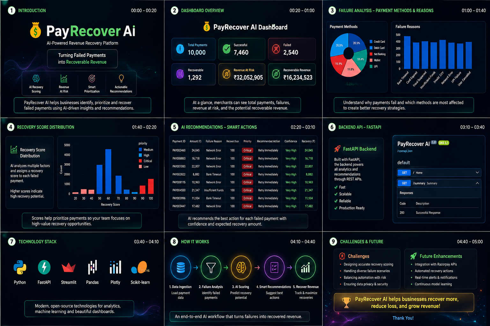

# 💰 PayRecover AI

## AI-Powered Revenue Recovery Platform 🚀

PayRecover AI is an intelligent payment recovery platform that analyzes failed transactions, predicts recovery potential, estimates revenue at risk, and recommends AI-driven actions to help businesses recover lost revenue.

---

# 🎯 Problem

Payment failures cause significant revenue loss for businesses. Most systems only report failed transactions but do not identify:

- Which payments can be recovered
- Why failures happen
- What recovery action should be taken

---

# 💡 Solution

PayRecover AI transforms failed payments into recovery opportunities using:

- Payment failure analysis
- Recovery scoring engine
- Revenue intelligence
- AI recovery recommendations

---

# ✨ Features

✅ AI Recovery Scoring  
✅ Failed Payment Analysis  
✅ Revenue At Risk Estimation  
✅ Recovery Probability Prediction  
✅ AI Recovery Recommendations  
✅ FastAPI REST Backend  
✅ Streamlit Analytics Dashboard  
✅ SQLite Database  
✅ Synthetic Payment Dataset (10,000+ records)

---

# 🏗️ Architecture


### System Workflow

```
Payment Dataset
        |
        ▼
Payment Analysis Engine
        |
        ▼
Revenue Intelligence Engine
        |
        ▼
Recovery Score Engine
        |
        ▼
AI Recovery Agent
        |
        ▼
Recovery Recommendations
        |
        ▼
Streamlit Dashboard
```

---

# 📊 Dashboard Preview



---

# 🛠️ Tech Stack

## Backend

- Python
- FastAPI
- SQLAlchemy
- SQLite

## AI / Analytics

- Pandas
- NumPy
- Machine Learning
- AI Decision Engine

## Frontend

- Streamlit
- Plotly

---

# 📂 Project Structure

```
PayRecover-AI/

│
├── app/
│   ├── api/
│   ├── models/
│   ├── services/
│   ├── recovery_agent.py
│   ├── recovery_score.py
│   └── revenue_engine.py
│
├── dashboard/
│   └── dashboard.py
│
├── data/
│   ├── payments.csv
│   └── recovery_predictions.csv
│
├── images/
│   └── dashboard.png
│
├── architecture.png
├── requirements.txt
└── README.md
```

---

# ▶️ Run Locally

## Install Dependencies

```bash
pip install -r requirements.txt
```

---

## Generate Recovery Predictions

```bash
python app/recovery_agent.py
```

---

## Start FastAPI Backend

```bash
python -m uvicorn app.main:app --reload
```

API Documentation:

```
http://127.0.0.1:8000/docs
```

---

## Start Dashboard

```bash
python -m streamlit run dashboard/dashboard.py
```

Dashboard:

```
http://localhost:8501
```

---

# 📊 Dashboard Includes

- Payment Analytics
- Revenue At Risk
- Recoverable Revenue
- Recovery Score Distribution
- AI Recommendations
- Payment Method Analysis
- Failure Reason Analysis

---

# 🔮 Future Improvements

- Gemini/OpenAI LLM Integration
- Razorpay API Integration
- Automated Payment Retry Workflow
- Email & SMS Recovery Automation
- Production ML Recovery Prediction Model
- Human Approval Workflow

---

# 🌐 Project Links

GitHub Repository:

https://github.com/projects-info/PayRecover-AI

Author:

**Yarlagadda Sindhu Bhargavi Chowdary**

GitHub:

https://github.com/projects-info
